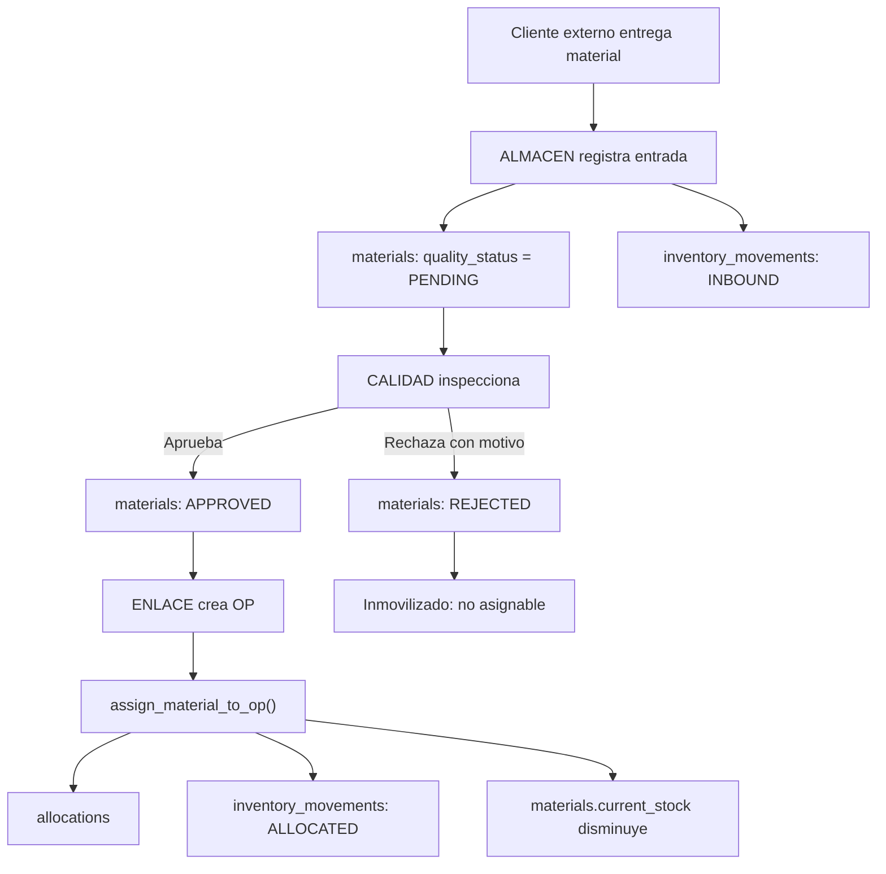
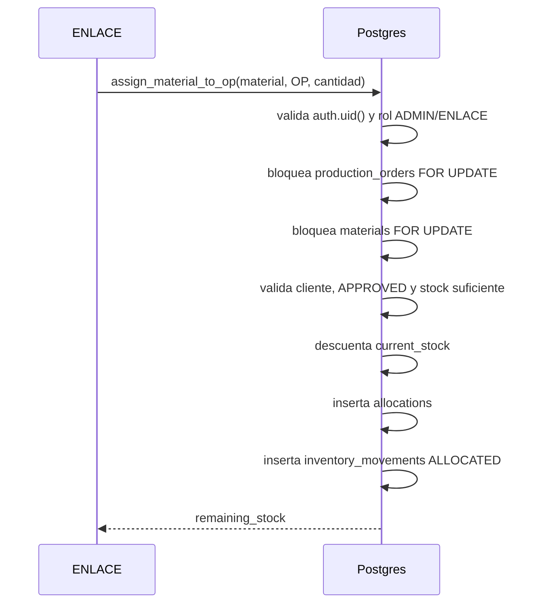
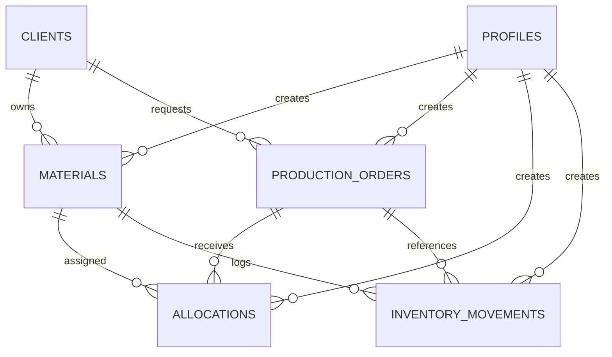

# Flujo del sistema

Guia rapida del inventario de materiales en consignacion. El sistema controla cantidades, ubicacion, calidad y trazabilidad; no maneja precios ni contabilidad.

## Roles

- `ALMACEN`: registra entradas fisicas, ubicacion y consulta inventario.
- `CALIDAD`: aprueba o rechaza material pendiente.
- `ENLACE`: crea OP y asigna material aprobado.
- `ADMIN`: administra usuarios y tiene vista global.

## Flujo principal



## Paso 1: Entrada de material

Ruta: `/almacen/entrada`

ALMACEN selecciona cliente, categoria, familia y ubicacion.

Para `BOBINA`:

- Captura ancho, diametro externo, diametro de nucleo y peso real.
- Los metros lineales se calculan automaticamente.
- Si hay gramaje, se calcula por `peso + gramaje + ancho`.
- Si no hay gramaje pero hay espesor, se calcula por geometria de bobina.

Para `PLIEGO`:

- Captura largo, ancho y piezas.

Efectos:

- Inserta en `materials`.
- Estado inicial: `PENDING`.
- Unidad interna: `MT` para bobina, `PCS` para pliego.
- UI: `m.l.` y `pza.`.
- Trigger crea `inventory_movements.INBOUND`.

## Paso 2: Calidad

Ruta: `/calidad/pendientes`

CALIDAD ve solo materiales `PENDING`.

Acciones:

- Aprobar: cambia a `APPROVED` y registra `QUALITY_APPROVED`.
- Rechazar: exige observacion, cambia a `REJECTED` y registra `QUALITY_REJECTED`.

Regla critica: material `REJECTED` no puede asignarse a OP aunque tenga stock.

## Paso 3: Clientes y OP

Rutas:

- `/enlace/clientes`
- `/enlace/ordenes`

ENLACE administra clientes externos y crea OP.

Clientes:

- RFC unico.
- ENLACE y ADMIN pueden crear/editar datos de contacto.
- ALMACEN y CALIDAD solo consultan.

OP:

- Se crea en `production_orders`.
- Estado inicial: `PENDING`.
- Se asocia a un cliente.

## Paso 4: Asignacion de material

Ruta: `/enlace/asignar/[orderId]`

ENLACE solo ve material:

- `APPROVED`.
- Del mismo cliente de la OP.
- Con `current_stock > 0`.

La asignacion usa `public.assign_material_to_op()`:



Regla critica: la asignacion es atomica. Dos usuarios no pueden sobreasignar el mismo stock.

## Tablas principales

- `profiles`: rol de usuario.
- `clients`: clientes externos.
- `material_categories`: categorias de material.
- `materials`: stock fisico, ubicacion y estado de calidad.
- `production_orders`: OP.
- `allocations`: asignaciones de material a OP.
- `inventory_movements`: bitacora append-only.

## Relaciones



## Estados

Material:

- `PENDING`: registrado, pendiente de calidad.
- `APPROVED`: asignable.
- `REJECTED`: inmovilizado.

OP:

- `PENDING`: sin asignacion.
- `ALLOCATED`: ya tiene material asignado.
- `CLOSED` / `CANCELLED`: reservado para cierre operativo.

Movimientos:

- `INBOUND`: entrada de almacen.
- `QUALITY_APPROVED`: aprobado por calidad.
- `QUALITY_REJECTED`: rechazado por calidad.
- `ALLOCATED`: asignado a OP.
- `RETURNED_FROM_OP`: futuro.
- `ADJUSTMENT`: reservado.

## Reglas no negociables

1. No hay campos monetarios.
2. Material rechazado no se asigna.
3. La asignacion descuenta stock en Postgres con bloqueo de fila.
4. `inventory_movements` es append-only.
5. RLS y Server Actions validan rol.
6. ENLACE no inserta directo en `allocations`; usa `assign_material_to_op()`.

## Dashboards

- `/almacen`: entradas, pendientes, stock, distribucion por cliente/categoria.
- `/calidad`: pendientes, aprobados/rechazados, ultimos revisados.
- `/enlace`: OP, asignaciones, stock disponible.
- `/admin`: usuarios, materiales, OP y estado general.

## Comandos utiles

```bash
npm run dev
npm run build
npm run lint
npm run seed
npm run validate:functional
```

